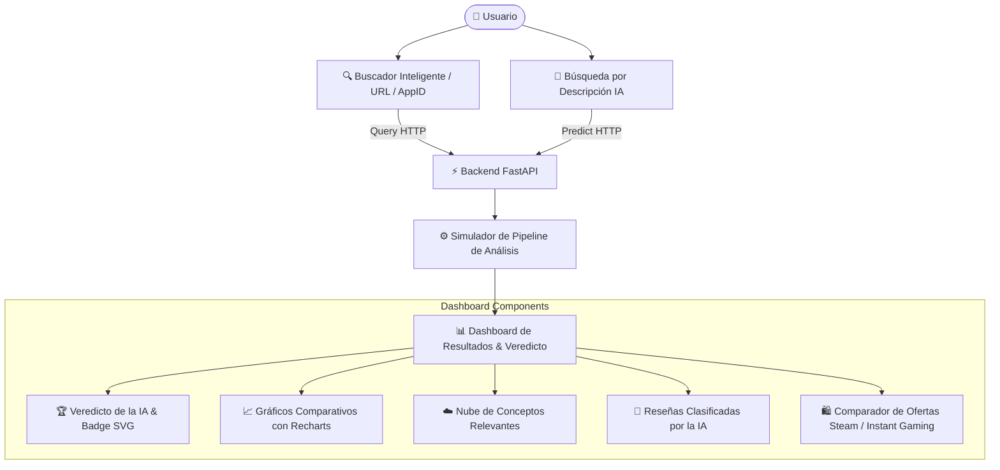

# 🎮 Game Recommended AI — Frontend Client 💻✨

[](https://game-recommended.alejandrotg.es)
[](https://react.dev/)
[](https://vite.dev/)
[](https://tailwindcss.com/)
[](https://pnpm.io/)
[](https://vitest.dev/)

Cliente web moderno, rápido e interactivo desarrollado en **React 19** y **Tailwind CSS v4** para la plataforma **Game Recommended AI**. Permite a los usuarios consultar y analizar de forma inteligente la recomendación real de videojuegos en Steam mediante Inteligencia Artificial y Procesamiento de Lenguaje Natural (NLP).

🚀 **[Explora la Aplicación en Vivo](https://game-recommended.alejandrotg.es)**

---

## 🎨 Vista General y Experiencia de Usuario (UI/UX)

La aplicación ofrece un diseño responsivo con estética *Dark Mode*, degradados sutiles, efectos de *glassmorphism* y micro-animaciones fluidas.



---

## ✨ Características Clave

* 🔍 **Búsqueda Dual e Inteligente**:
  * **Por Título o AppID**: Buscador con sugerencias de autocompletado en tiempo real.
  * **Por Descripción (IA)**: Recomienda el TOP 10 de juegos según la descripción en lenguaje natural introducida por el usuario.
* ⚙️ **Simulador de Pipeline de Carga**: Animación dinámica en pantalla durante la llamada a la API que muestra en tiempo real las etapas del procesamiento de NLP e inferencia del modelo.
* 📊 **Dashboard Interactivo con Recharts**:
  * **Veredicto de la IA**: Clasificación clara (*Extremadamente Recomendado*, *Recomendado*, *Mixto*, *No Recomendado*).
  * **Ratio de Aprobación Real**: Comparativa del porcentaje calculado por el modelo IA frente a la calificación oficial de Steam.
  * **Etiquetas y Nube de Palabras**: Extracción semántica de conceptos clave en las opiniones de los usuarios.
  * **Insignia SVG para GitHub**: Generador con opción de copia en 1-click para incrustar el badge dinámico en archivos Markdown.
* 🛍️ **Comparador de Precios Directo**: Enlaces optimizados para comparar y adquirir títulos en tiendas autorizadas.
* 📖 **Transparencia Técnica & Changelog**: Secciones explicativas integradas ("¿Cómo funciona?") para auditar el funcionamiento interno del sistema.

---

## 🛠️ Stack Tecnológico

| Tecnología | Descripción |
| :--- | :--- |
| **React 19** | Biblioteca declarativa para componentes reactivos de alta velocidad |
| **Vite 8** | Bundler y entorno de desarrollo ultra-rápido con HMR instantáneo |
| **Tailwind CSS v4** | Motor CSS sin archivo de configuración masivo, optimizado en rendimiento |
| **React Router v7** | Enrutamiento cliente para navegar fluidamente entre vistas |
| **Recharts** | Biblioteca de gráficos basada en React para visualización de estadísticas |
| **Vitest & Testing Library** | Suite de pruebas unitarias y de componentes UI |

---

## 📁 Estructura del Repositorio

```text
frontend/
├── public/                 # Recursos estáticos e iconos
├── src/
│   ├── components/         # Componentes modulares reutilizables
│   │   ├── Header.jsx              # Barra de navegación principal
│   │   ├── Input.jsx               # Buscador inteligente con autocompletado
│   │   ├── RecommendationCard.jsx  # Tarjeta de veredicto, badges y visualización
│   │   ├── HowItWorks.jsx          # Sección explicativa de la arquitectura IA
│   │   └── Changelog.jsx           # Registro histórico de versiones y mejoras
│   ├── services/           # Capa de comunicación con la API Backend
│   │   ├── steamService.js         # Métodos de búsqueda, análisis y recomendación
│   │   └── healthService.js        # Monitorización de estado de los servicios
│   ├── App.jsx             # Definición de rutas principales
│   ├── App.css             # Estilos globales y tokens de Tailwind v4
│   └── main.jsx            # Punto de entrada de React
├── .env.development        # Variables para entorno local
├── .env.production         # Variables para entorno en producción
├── eslint.config.js        # Configuración de linter ESLint
├── package.json            # Scripts y dependencias del proyecto
└── vite.config.js          # Configuración del servidor de desarrollo e hiper-build
```

---

## 🚀 Instalación y Desarrollo Local

### 1. Requisitos Previos
* [Node.js](https://nodejs.org/) v18+ 
* [pnpm](https://pnpm.io/) (recomendado) o `npm` / `yarn`.

### 2. Pasos para Iniciar

1. Navegar a la carpeta del frontend:
   ```bash
   cd frontend
   ```

2. Instalar las dependencias:
   ```bash
   pnpm install
   ```

3. Iniciar el servidor de desarrollo:
   ```bash
   pnpm dev
   ```
   La aplicación se abrirá por defecto en `http://localhost:5173`. Asegúrate de tener corriendo el servidor de FastAPI en `http://localhost:8000`.

---

## 📜 Comandos Disponibles

| Comando | Descripción |
| :--- | :--- |
| `pnpm dev` | Inicia el servidor de desarrollo con HMR instantáneo |
| `pnpm build` | Compila la aplicación optimizada para producción en `/dist` |
| `pnpm preview` | Sirve la versión compilada de producción de forma local |
| `pnpm test` | Ejecuta las pruebas unitarias con Vitest en modo watcher |
| `pnpm test:run` | Ejecuta las pruebas una única vez |
| `pnpm lint` | Analiza el código fuente con ESLint en busca de errores |

---

## 🔑 Variables de Entorno

Definidas en `.env.development`:

```ini
# .env.development
VITE_API_URL_DEV=http://localhost:8000
```

---

Desarrollado por [Alejandro Tacoronte González](https://alejandrotg.es).
